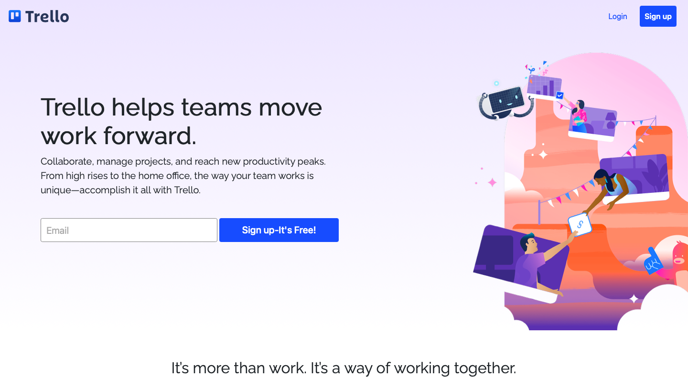

# chingu-project.github.io

## Overview

This is a solo project of, making a clone of [Trello](https://trello.com). The project is made using HTML, SASS, and JavaScript mainly. You can also have a look at the [website](https://guneetsinghtuli.github.io/chingu-project/).

---

## Screenshots

---

## Installation

1. Clone the project locally using `git clone`

## File System

The starting file is the index.html, for SASS it's styles, i have used SASS modules to make the code easily readable which is in the partials folder. Components have component or parts of the website like carousel and sections.

1. Variables as it's name suggest have all the SASS variables i have used in the project.

2. base have resets for the browser as well as the Mixins that were used in the project.

3. Dynamic which have the classes that are inserted and removed using JavaScript
